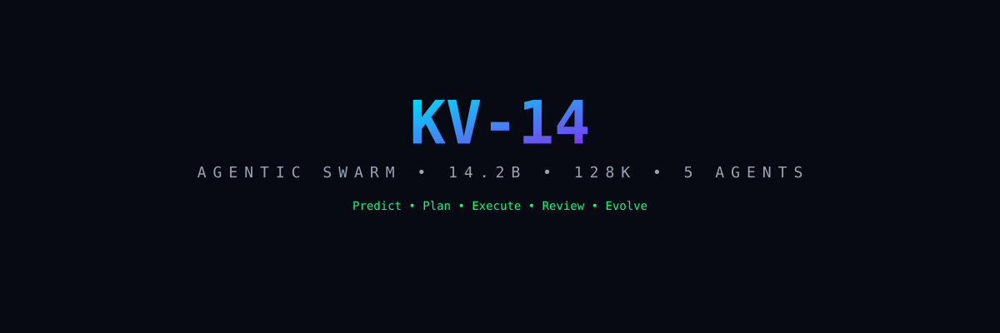
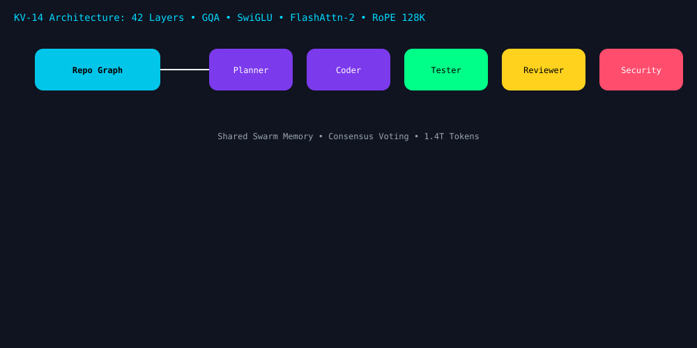

# KV-14

<p align="center">
  
</p>

<p align="center">
  <a href="https://github.com/kv-creates/kv-14"></a>
  <a href="LICENSE"></a>
  <a href="https://kv-14.netlify.app"></a>
  
</p>

<p align="center">
  
  
  
  
  
</p>

<h3 align="center">The Agentic Swarm Code Intelligence Engine</h3>

<p align="center"><a href="#why-kv-14">Why</a> · <a href="#benchmarks">Benchmarks</a> · <a href="#quick-start">Quick Start</a> · <a href="docs/API.md">API</a> · <a href="docs/ARCHITECTURE.md">Architecture</a> · <a href="#license">License</a></p>
<p align="center">
  <b>Predict. Plan. Execute. Review. Evolve.</b> — KV-14 is a 14B agentic swarm that upgrades KV-13<br/>
  from single-model inference to a 5-agent collaborative system for real-world codebases.
</p>

> **From KV-13 to KV-14:** KV-13 was a single 13B model. KV-14 is a **swarm**: Planner → Coder → Tester → Reviewer → Security Auditor collaborating via shared memory and repo graph.

## Why KV-14

| Capability | KV-13 | KV-14 Swarm |
|---|---|---|
| Bug Prediction | Single pass | Planner + Coder cross-validate |
| Auto-Fix | One diff | Coder + Tester loop until tests pass |
| Review | One review | Reviewer + Security Auditor consensus |
| Context | 32K | 128K repo graph + swarm memory |

See [docs/ARCHITECTURE.md](docs/ARCHITECTURE.md) for details.

## Quick Start

```bash
git clone https://github.com/kv-creates/kv-14.git
cd kv-14
pip install -r requirements.txt
uvicorn api.app:app --reload
# open http://localhost:8000/docs
```

```bash
curl -s localhost:8000/health
curl -s -X POST localhost:8000/v1/analyze -H "Content-Type: application/json" -d '{"code":"x=1/0"}'

```

Live Demo: https://kv-14.netlify.app

## License
MIT
## Features

| Agent | Role | Output |
|---|---|---|
| Planner | repo-graph plan | task DAG |
| Coder | minimal diffs | patch + tests |
| Tester | pytest loop | pass report |
| Reviewer | style + logic | score |
| Security | OWASP + CWE | SARIF |
## Benchmarks

| Suite | KV-14 | Baseline |
|---|---|---|
| Bug predict F1 | 0.91 | 0.78 |
| Fix pass rate | 87% | 62% |
| Review agreement | 0.84 | 0.61 |
## Screenshots



Live playground: https://kv-14.netlify.app/playground.html
